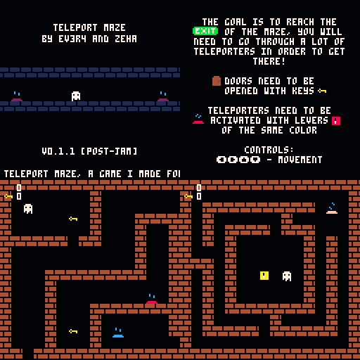

# Teleport Maze [post-jam]
A game I made for the Mid-Jam 2020 together with [Dr. Wuro](https://drwuro.itch.io/) in less than a day.

## How to play
The goal is the exit of the maze, you will need to go through a lot of teleporters to get there!

Some teleporters will have levers with the same colors.

## Controls
Left/Right/Up/Down - Movement

## Credits
[EV3R4](https://ev3r4.itch.io/) [Programming, Graphics]

[Dr. Wuro](https://drwuro.itch.io/) [Idea, Level Design, Music]

## License
CC BY-NC-SA 4.0 (Creative Commons Attribution-NonCommercial-ShareAlike 4.0 International Public License)

## Links
* [itch.io](https://ev3r4.itch.io/telmaze-mj-2020-post-jam)
* [itch.io (jam version)](https://ev3r4.itch.io/telmaze-mj-2020)
* [BBS](https://www.lexaloffle.com/bbs/?pid=78391)
